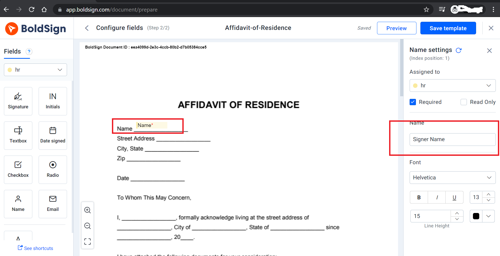

# BoldSign API CSharp demo samples

This repository includes the below list of code examples using the BoldSign APIs:

- [Send document for signing](/BoldSignDemos/Pages/CreateDocument/)
- [List and get detailed information of the documents](/BoldSignDemos/Pages/ListDocument/)
- [Send document from template](/BoldSignDemos/Pages/TemplateDocument/)
- [Embed signing process within your app](/BoldSignDemos/Pages/EmbeddedSign/)
- [Redirect to signing page from your app](/BoldSignDemos/Pages/EmbeddedSignWithForm/)

## Introduction

The BoldSign API allows you to send documents to collect e-signatures from within your app. BoldSign has a necessary set of APIs that give you complete control over documents and properties.

### Install the package

dotnet add package BoldSign.Api
The other ways of installing a package are available here:
[Install and manage NuGet packages in Visual Studio](https://docs.microsoft.com/en-us/nuget/consume-packages/install-use-packages-visual-studio)

### Compatibility

1. .NET Core 2.0 or above.
2. Microsoft .NET version 4.5.2+;

### Prerequisites
1.	Signup for [BoldSign trial](https://account.boldsign.com/signup?planId=101)
2.	Install BoldSign API’s NuGet package with the following command.
```csharp
dotnet add package BoldSign.Api
```
3.	Acquire needed BoldSign app credentials from here. [Authentication - Help Center - BoldSign](https://www.boldsign.com/help/api/general/authentication/#basic-authentication)
4.	Now you got all the prerequisites ready to start embedding BoldSign API.


### Steps to run samples:

1.	Add ClientID & ClientSecret in your system environment variables.

```cs
//client id for get access token -->

string clientId = Environment.GetEnvironmentVariable("ClientID");

//client secret for get access token

string clientSecret = Environment.GetEnvironmentVariable("ClientSecret");

```
          
2.	For Template document and EmbeddedSign sample, you need to [create template](https://www.boldsign.com/help/getting-started/creating-templates/) with the following scenarios.

    a.	For the Template document sample, create a template with Name and Email form fields, and change name of the fields in respective field settings to SignerName and SignerEmail.

    b.	For Embedded Sign sample, create a template with Name, Address, State, PostalCode form fields and change name of the fields in respective field settings to SignerName, SignerAddress, SignerState, SignerPostalCode.

    
 
Please refer to this [link](https://www.boldsign.com/help/api/template/send-document-to-sign-using-template/#send-document-from-template-by-filling-existing-fields) for adding form fields with names.
